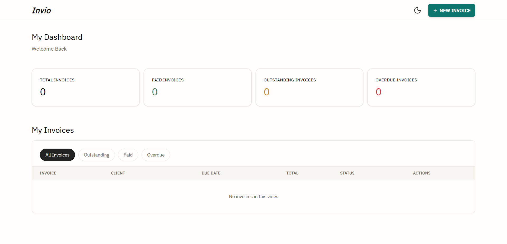

# Invio - Invoice Generator

An Invoice generator built with React. Create, manage, and export invoices as PDF - with a live preview as you type.

**[Live Demo](https://invio-eight.vercel.app)**

## Preview



---

## Features

- Live Preview - invoice updates in real time as you fill the form
- PDF Export - download a professionally formatted PDF instantly 
- Dashboard - view all invoices with status tracking (Draft, Sent, Paid, Overdue)  
- Dark / Light Mode - toggle between themes
- Auto Save - invoices persist to local storage automatically 
- Dynamic Line Items - add, and remove line items with auto-calculated totals  
- Status Filtering - filter invoices by status on the dashboard  

---

## Tech Stack

- React  
- TypeScript  
- Tailwind CSS  
- shadcn/ui
- Zustand (with persist middleware)
- React Hook Form with Zod Validation
- @react-pdf/renderer for generating PDF
- React Router v6
- Vercel

---

## Architecture Decisions

**Zustand over Redux** - invoice state is straightforward enough that Redux would be overkill. Zustand's persist middleware handles localStorage sync in one line, replacing the need for a custom hook.

**RHF + Zustand separation** - React Hook Form owns form state for a short time, Zustand owns persisted application state. They sync at save boundaries keeping form performance fast and global state clean.

**react-pdf/renderer over html2pdf** - builds the PDF as a dedicated React component tree rather than converting DOM to PDF. Gives more control over output.

---

## Installation & Setup

```bash
# Clone the project
git clone https://github.com/Anurag2516/invio-invoice-generator

# Navigate to project folder
cd invio-invoice-generator

# Install dependencies
npm install

# Start development server
npm run dev

# Build for production
npm run build

```
---

## License
This project is licensed under the MIT License — see the LICENSE file for details.